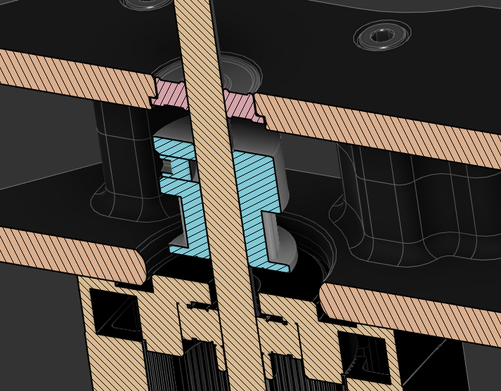

### AB Drives with Upper Bearing Support

Add a little more rigidity to your belt path, with long-shaft steppers and an opposed bearing to keep your belt tension from bending shafts. Additionally, the longer shaft steppers I'm recommending are just fantastic, and a great upgrade on their own.

The 9mm parts are modded versions of 

### Bill of Materials

| Count | Part                    | Source |
|-------|-------------------------|--------|
| 2     | LDO 42STH48-2504AH(s55) | [DFH.fm](https://dfh.fm/products/LDO-42STH48-2504AH-S55) or [Luke's Lab Online](https://lukeslabonline.com/collections/ldo/products/longboi-ldo-nema-17-motor-high-temp-ldo-42sth48-2504ahs55) |
| 2     | F695-2RS Bearings       | [DFH.fm](https://dfh.fm/products/f695-2rs-flanged-ball-bearing) |

### Printing

Make sure your extrusion multiplier is tuned, there is a [test print for bearing fit](./STLs/Bearing_Test_Print.stl) to make sure you are properly tuned. The bearings should snap into place with a little pressure and should not have much, if any side to side movement.

Use Voron part settings:

* 5 solid top and bottom layers
* 4 perimeters
* 0.4mm perimeter width
* 0.2mm layer height
* 40% infill

You need to print both the A and B drive frame uppers for whichever printer you are modding, i.e. a pinned V2.4 needs [V2.4 Pinned A Drive Frame Upper.stl](./STLs/V2.4_Pinned_A_Drive_Frame_Upper.stl) and [V2.4 Pinned B Drive Frame Upper.stl](./STLs/V2.4_Pinned_B_Drive_Frame_Upper.stl).
